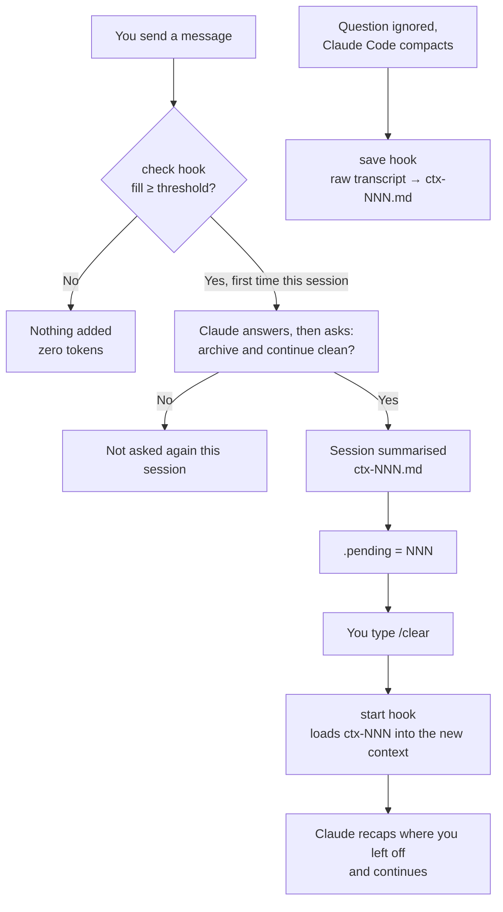
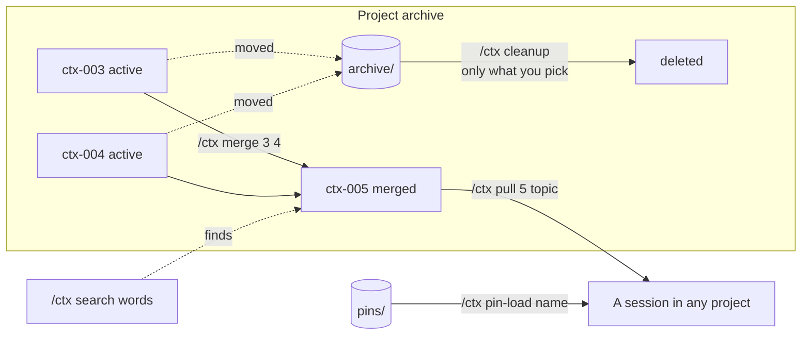

# ctx — numbered context archive for Claude Code

**English** · [Türkçe](README.tr.md)

Long Claude Code sessions get expensive, and their quality drops toward the end. **ctx** asks you, once the context reaches a fill level you choose, whether to archive the session as a short numbered summary and continue in a clean context that starts from it. You can look back at earlier contexts, search them, pull selected information into the current session, and merge or tidy them. Nothing is ever deleted without your approval.

- **Per project:** each project keeps its own `ctx-001`, `ctx-002`… archive; another project's context is never loaded.
- **Pins:** pin an important structure from one project (an auth flow, a design system…) and load it in another project only when you ask.
- **Status line:** see the project, the last context number and the current fill (`ctx myapp #004 | 62%`) at a glance.
- **Search:** find which context discussed what, without opening files.
- **Token-friendly:** below the threshold the hook adds nothing to the context; listings and search never open files; summaries are short and point to file paths instead of copying code.
- **Safe:** merged or tidied files are moved to an archive; permanent deletion happens only for the files you pick.
- **Global:** install once, works in every project. Windows (PowerShell) and macOS / Linux (Python).

## How it works





### Files

```
~/.claude/
├── skills/ctx/
│   ├── SKILL.md            instructions for Claude
│   └── scripts/
│       ├── ctx.ps1         hooks + helper (Windows)
│       └── ctx.py          hooks + helper (macOS / Linux)
├── settings.json           the installer adds 3 hooks and the status line
└── ctx/                    archive data (kept on uninstall)
    ├── settings.json
    ├── pins/
    │   └── auth-flow.md
    └── projects/
        └── myapp/
            ├── ctx-001.md
            ├── ctx-002.md
            └── archive/
```

The archive deliberately lives outside your projects, in `~/.claude/ctx` (or `$CLAUDE_CONFIG_DIR/ctx` if you set that variable), so summaries never end up in a project's git repository by accident. It stays there even if you install the skill into another `.claude` folder (see [below](#installing-into-another-claude-folder)).

### Hooks

| Event | Mode | What it does |
|---|---|---|
| `UserPromptSubmit` | `check` | Estimates the fill from the last assistant message's token usage; past the threshold it leaves one note per session. |
| `PreCompact` | `save` | Writes the conversation to the archive as a raw record before Claude Code compacts it. |
| `SessionStart` | `start` | On `clear` loads a pending handoff; on `compact` reports the archive number; on `startup` reminds you when cleanup is due. |
| `statusLine` | `statusline` | `ctx <project> #<last number> \| <fill>%`, green / yellow / red relative to the threshold. |

## Install

Download or clone the repository, then:

**Windows (PowerShell):**
```powershell
powershell -ExecutionPolicy Bypass -File install\install.ps1
```

**macOS / Linux** (requires python3):
```bash
./install/install.sh
```
On Windows use `install.ps1`, not `install.sh` from Git Bash: there `python3` can resolve to the Microsoft Store stub and fail.

The installer:
1. Copies the skill to `~/.claude/skills/ctx`.
2. Backs up `~/.claude/settings.json` as `settings.json.bak-ctx`.
3. Adds the three hooks. Your existing settings and hooks are left untouched, and running it again does not duplicate anything.
4. Adds the ctx status line **only if you don't have one yet**. To replace yours, re-run with `-StatusLine` (Windows) or `--statusline` (macOS / Linux).
5. Copies a small plugin, `ctx-statusline`, to `~/.claude/skills/ctx-statusline`. The desktop app does not draw the `statusLine` setting, so the plugin shows `ctx <project> | NN%` there instead. In the terminal it stays quiet, because the status line from step 4 is already shown.

Restart Claude Code and check with `/hooks`.

### Installing into another `.claude` folder

By default ctx goes into `~/.claude` (or `$CLAUDE_CONFIG_DIR` if set). To install it into a different `.claude` folder, for example one that belongs to a vault or a single workspace, name that folder:

```powershell
powershell -ExecutionPolicy Bypass -File install\install.ps1 -ConfigDir F:\vault\.claude
```
```bash
./install/install.sh --config-dir ~/vault/.claude
```

- The skill, the three hooks and the status line are written into that folder's `skills/` and `settings.json`; nothing else is touched.
- The helper commands in the installed `SKILL.md` are rewritten to point at that folder, so Claude calls the right script.
- The archive stays in `~/.claude/ctx` (or `$CLAUDE_CONFIG_DIR/ctx`), so all your installs share one archive.
- **Install it in one place only.** Claude Code merges the hooks from every `settings.json` it reads, so ctx registered in two places runs twice per message. After installing, the installer looks at `~/.claude`, `$CLAUDE_CONFIG_DIR` and the `.claude` folder of every root you registered; if it finds another ctx copy, it prints a warning and the exact command to remove it. It never changes the other folder by itself.

### Using a root folder (vault)

If you open Claude Code in a folder whose sub-folders are separate projects (e.g. `F:\work\shop`, `F:\work\blog`), mark it as a **root**:

```powershell
powershell -ExecutionPolicy Bypass -File install\install.ps1 -Root F:\work
```
or, after installing, type `/ctx root F:/work` in Claude Code.

- Opened in a sub-folder: the project name is that sub-folder.
- Opened at the root itself: choose the active project with `/ctx project shop`.

Without a root, the project name is the folder Claude Code was opened in. Two folders with the same name (say, two `app` folders) are kept apart automatically.

## Usage

| Command | What it does |
|---|---|
| `/ctx` | Context list for this project |
| `/ctx save [title]` | Summarises the session under the next number |
| `/ctx handoff` | Saves; the next `/clear` opens with that record |
| `/ctx switch 3` | Continue in a clean context from ctx-003 |
| `/ctx pull 2 [topic]` | Brings the parts you choose from ctx-002 into the current session |
| `/ctx search <words>` | Searches this project's archive (`--all` for every project and the pins) |
| `/ctx show 3` | Shows the content |
| `/ctx summarize 3` | Turns a raw automatic record into a summary (with approval) |
| `/ctx merge 2 3` | Merges them; the originals go to the archive (with approval) |
| `/ctx tidy 4` | Cleans up one file; the old version goes to the archive (with approval) |
| `/ctx cleanup` | Permanently deletes the archive files you pick (with approval) |
| `/ctx pin <name>` | Saves an important structure as a cross-project pin |
| `/ctx pins` / `/ctx pin-load <name>` | Lists / loads pins |
| `/ctx threshold 60` | Fill percentage for the handoff question |
| `/ctx window 1000000` | Context window size |
| `/ctx root <path>` / `/ctx project <name>` | Root folder / active project |

You don't have to remember commands: plain requests such as "what was in context 2?" or "bring the login structure from the other project" trigger the skill too. Turkish command names (`kaydet`, `devir`, `al`, `ara`…) work as aliases, and Claude replies in your language.

## Settings

`~/.claude/ctx/settings.json` (changed by the commands above, or edit it by hand):

| Key | Default | Meaning |
|---|---|---|
| `window` | 200000 | Context window in tokens. Use `1000000` for 1M-context models. |
| `threshold` | 70 | Fill percentage at which the handoff question is asked |
| `cleanupEveryDays` | 14 | How often the cleanup reminder can appear |
| `archiveAgeDays` | 30 | Archive files older than this count as cleanup candidates |
| `maxActive` | 10 | Suggest merging when a project has this many active contexts |
| `roots` | `[]` | Root folders |

## Limitations

- **You type `/clear`.** Claude cannot start a new session itself, so a handoff takes two steps: approve, then `/clear`.
- **Summaries are lossy.** To reopen a whole session word for word, use Claude Code's `/resume`. ctx is for carrying knowledge between sessions.
- **The fill estimate reads token usage from the transcript file.** That format is not a documented Claude Code interface. If an update changes it, the hook simply goes quiet (it never errors or blocks Claude Code). If the handoff question or the status-line percentage stops appearing, look here first.
- **It doesn't know your window size.** On a 1M-context model, run `/ctx window 1000000`.
- **The hook runs a short script on every message.** On Windows, PowerShell takes about 0.3–0.5 s to start.

## Uninstall

```powershell
powershell -ExecutionPolicy Bypass -File install\install.ps1 -Uninstall
```
```bash
./install/install.sh --uninstall
```
Removes the skill, its hooks and its status line (a status line that isn't ctx's is left alone). Your archive in `~/.claude/ctx` is kept; delete it by hand if you no longer need it.

If you installed with `-ConfigDir` / `--config-dir`, pass the same folder to remove that copy:

```powershell
powershell -ExecutionPolicy Bypass -File install\install.ps1 -Uninstall -ConfigDir F:\vault\.claude
```
```bash
./install/install.sh --uninstall --config-dir ~/vault/.claude
```

## Development

`ctx.ps1` and `ctx.py` implement the same behaviour in two languages. Make every change in both and check that the tests pass for both.

```bash
tests/run-tests.sh both      # hooks, status line, search, helper modes, UTF-8 (50 scenarios × 2)
tests/test-install.sh both   # install / re-install / uninstall / status line handling / --config-dir / duplicate warning
```
```powershell
powershell -ExecutionPolicy Bypass -File tests\smoke.ps1   # Windows, sandboxed; also checks the installer against a copy of your settings
```
See [TESTING.md](TESTING.md) for the end-to-end checklist in Claude Code. The PowerShell runs of the bash suites need `pwsh` (`PWSH=/path/to/pwsh`). The `.ps1` files must stay pure ASCII so Windows PowerShell 5.1 reads them correctly; all hook and helper I/O is UTF-8.

## License

[MIT](LICENSE) © Buildyr
