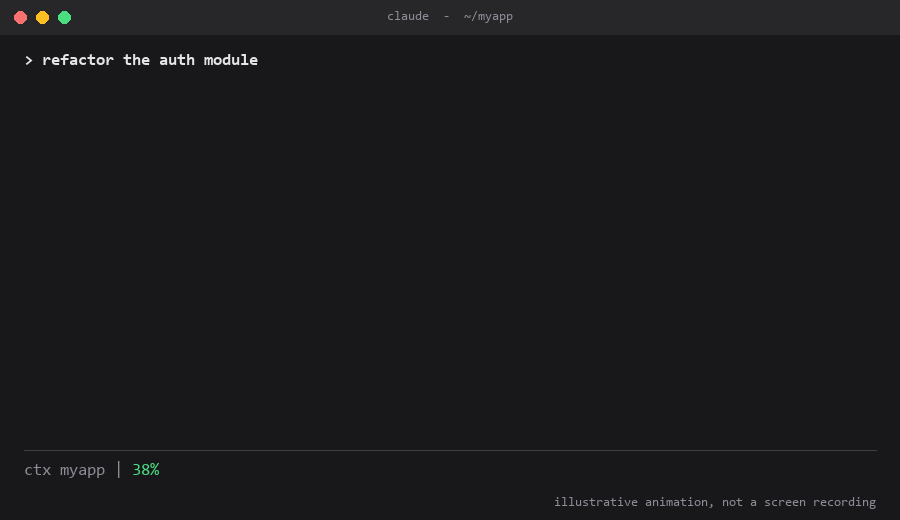
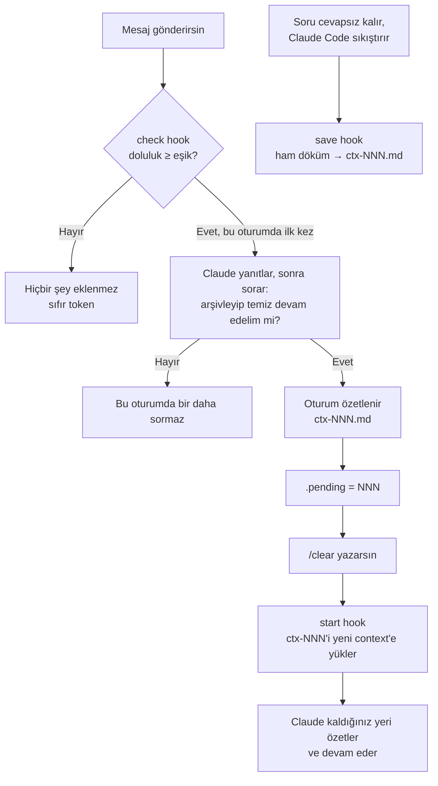
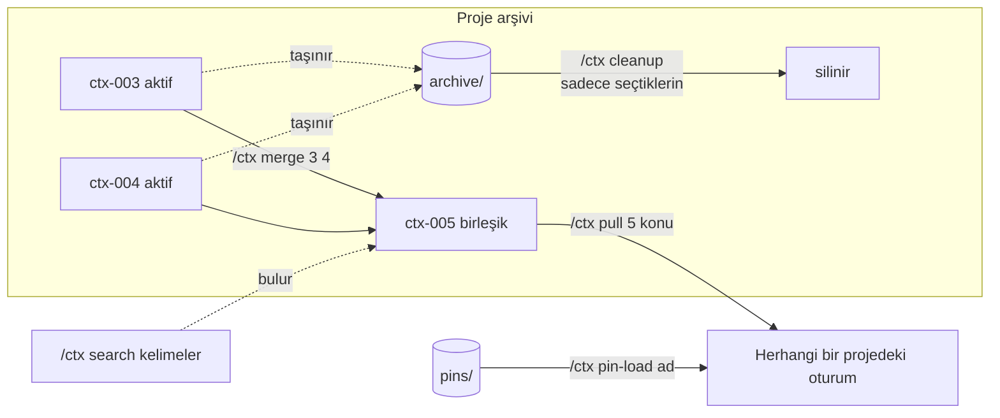

# ctx — Claude Code için numaralı context arşivi

[English](README.md) · **Türkçe**


<sub>ctx'in gerçek mesajlarına dayanan canlandırma; ekran kaydı değildir.</sub>

Uzun Claude Code oturumları hem pahalıdır hem de sonlara doğru kalitesi düşer. **ctx**, context belirlediğin doluluğa ulaşınca sana sorar: oturumu kısa ve numaralı bir özet olarak arşivleyip temiz bir context'te o özetle devam edelim mi? Eski context'lere bakabilir, içlerinde arama yapabilir, seçtiğin bilgiyi mevcut oturuma çekebilir, onları birleştirip sadeleştirebilirsin. Onayın olmadan hiçbir şey silinmez.

- **Proje bazlı:** her proje kendi `ctx-001`, `ctx-002`… arşivini tutar; başka projenin context'i hiç yüklenmez.
- **Pinler:** bir projedeki önemli bir yapıyı (auth akışı, tasarım sistemi…) pinlersin; başka bir projede sadece sen isteyince yüklenir.
- **Status line:** proje, son context numarası ve anlık doluluk tek bakışta görünür (`ctx uygulamam #004 | 62%`).
- **Arama:** hangi context'te ne konuşulduğunu dosya açmadan bulursun.
- **Token dostu:** hook eşiğin altındayken context'e hiçbir şey eklemez; listeleme ve arama dosya açmaz; özetler kısadır, kod kopyalamak yerine dosya yolu verir.
- **Güvenli:** birleştirilen ya da sadeleştirilen dosyalar arşive taşınır; kalıcı silme sadece senin seçtiğin dosyalar için yapılır.
- **Global:** bir kez kurulur, bütün projelerde çalışır. Windows (PowerShell), macOS ve Linux (Python) desteklenir.

## Nasıl çalışır





### Dosyalar

```
~/.claude/
├── skills/ctx/
│   ├── SKILL.md            Claude'un talimatları
│   └── scripts/
│       ├── ctx.ps1         hook'lar + yardımcı (Windows)
│       └── ctx.py          hook'lar + yardımcı (macOS / Linux)
├── settings.json           kurulum 3 hook ve status line ekler
└── ctx/                    arşiv verisi (kaldırınca da korunur)
    ├── settings.json
    ├── pins/
    │   └── auth-flow.md
    └── projects/
        └── uygulamam/
            ├── ctx-001.md
            ├── ctx-002.md
            └── archive/
```

Arşiv bilerek projelerin dışında, `~/.claude/ctx` altında (ya da bu değişkeni tanımladıysan `$CLAUDE_CONFIG_DIR/ctx` altında) tutulur. Böylece özetler hiçbir zaman yanlışlıkla bir projenin git deposuna girmez. Skill'i başka bir `.claude` klasörüne kursan bile arşiv burada kalır ([aşağıya](#başka-bir-claude-klasörüne-kurulum) bak).

### Hook'lar

| Olay | Mod | Ne yapar |
|---|---|---|
| `UserPromptSubmit` | `check` | Son asistan mesajının token kullanımından doluluğu hesaplar; eşik aşılınca oturum başına bir kez not bırakır. |
| `PreCompact` | `save` | Claude Code sıkıştırma yapmadan önce konuşmayı ham kayıt olarak arşive yazar. |
| `SessionStart` | `start` | `clear` olayında bekleyen devri yükler, `compact` olayında arşiv numarasını bildirir, `startup` olayında temizlik zamanı geldiyse hatırlatır. |
| `statusLine` | `statusline` | `ctx <proje> #<son numara> \| <doluluk>%`; eşiğe göre yeşil, sarı ya da kırmızı. |

## Kurulum

Depoyu klonla (ya da indir), sonra kurulum betiğini içinden çalıştır:

```bash
git clone https://github.com/buildyr/ctx-skill.git
cd ctx-skill
```

**Windows (PowerShell):**
```powershell
powershell -ExecutionPolicy Bypass -File install\install.ps1
```

**macOS / Linux** (python3 gerekli):
```bash
./install/install.sh
```
Windows'ta Git Bash'ten `install.sh` değil `install.ps1` kullan: orada `python3` Microsoft Store kısayoluna çözülüp hata verebilir.

Kurulum betiği şunları yapar:
1. Skill'i `~/.claude/skills/ctx` klasörüne kopyalar.
2. `~/.claude/settings.json` dosyasını `settings.json.bak-ctx` olarak yedekler.
3. Üç hook'u ekler. Mevcut ayarlarına ve hook'larına dokunmaz; tekrar çalıştırınca hiçbir şeyi çoğaltmaz.
4. ctx status line'ını **sadece hiç status line'ın yoksa** ekler. Seninkinin yerine geçsin istersen Windows'ta `-StatusLine`, macOS / Linux'ta `--statusline` ile yeniden çalıştır.
5. `ctx-statusline` adlı küçük bir plugin'i `~/.claude/skills/ctx-statusline` klasörüne kopyalar. Masaüstü uygulaması `statusLine` ayarını çizmez; bu plugin orada `ctx <proje> | NN%` satırını gösterir. Terminalde sessiz kalır, çünkü 4. adımdaki status line zaten görünür.

Claude Code'u yeniden başlat ve `/hooks` ile kontrol et.

### Başka bir `.claude` klasörüne kurulum

ctx varsayılan olarak `~/.claude` altına (`$CLAUDE_CONFIG_DIR` tanımlıysa oraya) kurulur. Farklı bir `.claude` klasörüne, örneğin bir vault'a ya da tek bir çalışma alanına ait olana kurmak için o klasörün adını ver:

```powershell
powershell -ExecutionPolicy Bypass -File install\install.ps1 -ConfigDir F:\vault\.claude
```
```bash
./install/install.sh --config-dir ~/vault/.claude
```

- Skill, üç hook ve status line o klasörün `skills/` ve `settings.json` dosyalarına yazılır; başka hiçbir şeye dokunulmaz.
- Kurulan `SKILL.md` içindeki yardımcı komutlar o klasöre işaret edecek şekilde yeniden yazılır; böylece Claude doğru script'i çağırır.
- Arşiv `~/.claude/ctx` altında (ya da `$CLAUDE_CONFIG_DIR/ctx` altında) kalır; bütün kurulumların tek bir arşivi paylaşır.
- **Sadece tek yere kur.** Claude Code okuduğu her `settings.json` içindeki hook'ları birleştirir; ctx iki yerde kayıtlıysa her mesajda iki kez çalışır. Kurulumdan sonra betik `~/.claude`, `$CLAUDE_CONFIG_DIR` ve kayıtlı her kökün `.claude` klasörüne bakar; başka bir ctx kopyası bulursa uyarı ve onu kaldıran komutu yazar. Diğer klasörü kendi başına asla değiştirmez.

### Kök klasör (vault) kullanıyorsan

Claude Code'u alt klasörleri ayrı projeler olan bir klasörde açıyorsan (ör. `F:\is\dukkan`, `F:\is\blog`), o klasörü **kök** olarak işaretle:

```powershell
powershell -ExecutionPolicy Bypass -File install\install.ps1 -Root F:\is
```
ya da kurduktan sonra Claude Code'da `/ctx root F:/is` yaz.

- Alt klasörde açarsan proje adı o alt klasör olur.
- Kökün kendisinde açarsan aktif projeyi `/ctx project dukkan` ile seçersin.

Kök işaretli değilse proje adı, Claude Code'un açıldığı klasörün adıdır. Aynı adlı iki klasör (ör. iki ayrı `app`) otomatik olarak ayrı tutulur.

## Kullanım

| Komut | Türkçe karşılığı | Ne yapar |
|---|---|---|
| `/ctx` | `liste` | Bu projenin context listesi |
| `/ctx save [başlık]` | `kaydet` | Oturumu özetleyip yeni numaraya kaydeder |
| `/ctx handoff` | `devir` | Kaydeder; sonraki `/clear` o kayıtla açılır |
| `/ctx switch 3` | `gec` | ctx-003'ten temiz bir context'le devam eder |
| `/ctx pull 2 [konu]` | `al` | ctx-002'den seçtiğin kısımları mevcut oturuma getirir |
| `/ctx search <kelimeler>` | `ara` | Bu projenin arşivinde arar (`--all` ile bütün projeler ve pinler) |
| `/ctx show 3` | `goster` | İçeriği gösterir |
| `/ctx summarize 3` | `ozetle` | Ham otomatik kaydı özete çevirir (onaylı) |
| `/ctx merge 2 3` | `birlestir` | Birleştirir; eskiler arşive gider (onaylı) |
| `/ctx tidy 4` | `temizle` | Tek dosyayı sadeleştirir; eski hâli arşive gider (onaylı) |
| `/ctx cleanup` | `temizlik` | Arşivden seçtiğin dosyaları kalıcı olarak siler (onaylı) |
| `/ctx pin <ad>` | `pin` | Önemli bir yapıyı projeler arası pin olarak kaydeder |
| `/ctx pins` / `/ctx pin-load <ad>` | `pinler` / `pin-al` | Pinleri listeler / yükler |
| `/ctx threshold 60` | `limit` | Devir sorusunun sorulacağı doluluk yüzdesi |
| `/ctx window 1000000` | `pencere` | Context penceresi boyutu |
| `/ctx root <yol>` / `/ctx project <ad>` | `kok` / `proje` | Kök klasör / aktif proje |

Komut ezberlemen gerekmez: "2. context'te ne vardı?", "diğer projedeki login yapısını getir" gibi düz cümleler de skill'i tetikler. Claude sana senin dilinde yanıt verir.

## Ayarlar

`~/.claude/ctx/settings.json` (yukarıdaki komutlarla değişir, elle de düzenlenebilir):

| Anahtar | Varsayılan | Anlamı |
|---|---|---|
| `window` | 200000 | Context penceresi (token). 1M context'li modellerde `1000000` yap. |
| `threshold` | 70 | Devir sorusunun sorulacağı doluluk yüzdesi |
| `cleanupEveryDays` | 14 | Temizlik hatırlatmasının en fazla ne sıklıkla geleceği (gün) |
| `archiveAgeDays` | 30 | Arşivde bundan eski dosyalar temizlik adayı sayılır |
| `maxActive` | 10 | Bir projede bu kadar aktif context birikince birleştirme önerilir |
| `roots` | `[]` | Kök klasörler |

## Sınırlamalar

- **`/clear` komutunu sen yazarsın.** Claude yeni oturumu kendisi başlatamaz; bu yüzden devir iki adımlıdır: önce onay, sonra `/clear`.
- **Özetler kayıplıdır.** Bir oturumu kelimesi kelimesine geri açmak için Claude Code'un `/resume` komutunu kullan. ctx, oturumlar arasında bilgi taşımak içindir.
- **Doluluk tahmini, token kullanımını transcript dosyasından okur.** Bu format Claude Code'un belgelenmiş bir arayüzü değildir. Bir güncelleme onu değiştirirse hook sadece susar; asla hata vermez ve Claude Code'u engellemez. Devir sorusu ya da status line'daki yüzde görünmez olursa ilk bakılacak yer burasıdır.
- **Pencere boyutunu bilmez.** 1M context'li bir modelde `/ctx window 1000000` çalıştır.
- **Hook her mesajda kısa bir script çalıştırır.** Windows'ta PowerShell'in açılması yaklaşık 0,3–0,5 saniye sürer.

## Kaldırma

```powershell
powershell -ExecutionPolicy Bypass -File install\install.ps1 -Uninstall
```
```bash
./install/install.sh --uninstall
```
Skill'i, hook'larını ve status line'ını kaldırır; ctx'e ait olmayan bir status line'a dokunmaz. `~/.claude/ctx` altındaki arşivin korunur; istemiyorsan elle silebilirsin.

`-ConfigDir` / `--config-dir` ile kurduysan, o kopyayı kaldırmak için aynı klasörü ver:

```powershell
powershell -ExecutionPolicy Bypass -File install\install.ps1 -Uninstall -ConfigDir F:\vault\.claude
```
```bash
./install/install.sh --uninstall --config-dir ~/vault/.claude
```

## Geliştirme

`ctx.ps1` ve `ctx.py` aynı davranışı iki farklı dilde uygular. Her değişikliği ikisine de yap ve testlerin ikisinde de geçtiğini doğrula.

```bash
tests/run-tests.sh both      # hook'lar, status line, arama, yardımcı modlar, UTF-8 (50 senaryo × 2)
tests/test-install.sh both   # kurulum / yeniden kurulum / kaldırma / status line / --config-dir / çift kurulum uyarısı
```
```powershell
powershell -ExecutionPolicy Bypass -File tests\smoke.ps1   # Windows, geçici klasörde; kurulumu ayarlarının bir kopyası üzerinde de dener
```
Claude Code içindeki uçtan uca kontrol listesi [TESTING.md](TESTING.md) dosyasında (İngilizce). Bash testlerinin PowerShell çalıştırmaları için `pwsh` gerekir (`PWSH=/yol/pwsh`). `.ps1` dosyaları, Windows PowerShell 5.1'in doğru okuyabilmesi için tamamen ASCII kalmalı; hook ve yardımcı modların bütün girdi/çıktısı UTF-8'dir.

## Lisans

[MIT](LICENSE) © Buildyr
